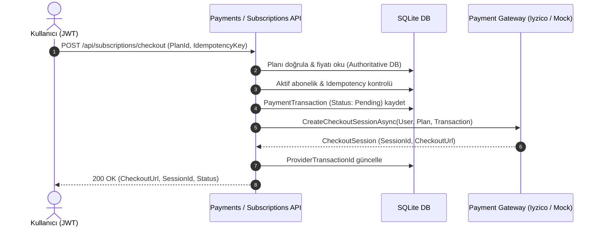
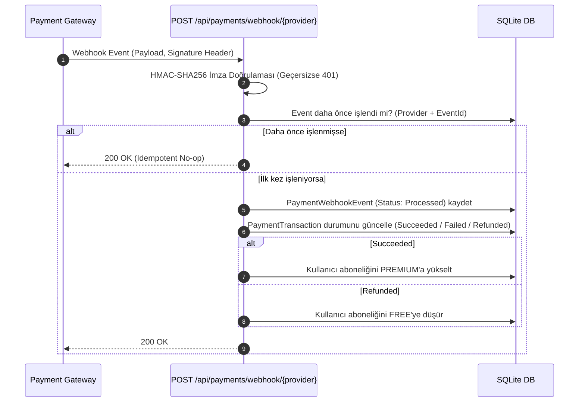

# StockTracker Production Billing & Payment Architecture (FAZ 12)

Bu doküman, StockTracker SaaS platformunun ödeme mimarisini, sağlayıcı soyutlamasını (`IPaymentService` & `IPaymentProvider`), Iyzico & Mock entegrasyonlarını, checkout & webhook akışlarını, idempotency mekanizmasını ve güvenlik kurallarını açıklar.

---

## 1. Ödeme Mimarisi (Payment Architecture)

Platform, sağlayıcıdan bağımsız (Provider-Agnostic) bir mimariye sahiptir:

```
[İstemci (Web / Mobil)]
       │
       ▼
[SubscriptionsController / PaymentsController]
       │
       ▼
[IPaymentService (PaymentService)]
       │
   ┌───┴───────────────────────────────┐
   ▼                                   ▼
[MockPaymentProvider]        [IyzicoPaymentService]
(Geliştirme / Test / CI)     (Production / Sandbox)
```

### 1.1. Sağlayıcı Seçimi & Konfigürasyon
Ödeme sağlayıcısı `appsettings.json` veya çevre değişkenleri (`Payment:Provider`) üzerinden dinamik olarak belirlenir:

```json
{
  "Payment": {
    "Provider": "Mock",
    "Mock": {
      "WebhookSecret": "mock_webhook_secret_key_2026"
    },
    "Iyzico": {
      "ApiKey": "sandbox-apiKey",
      "SecretKey": "sandbox-secretKey",
      "BaseUrl": "https://sandbox-api.iyzipay.com",
      "CallbackUrl": "https://app.stocktracker.local/api/payments/callback/iyzico",
      "WebhookSecretKey": ""
    }
  }
}
```

---

## 2. Checkout Akışı (Checkout Flow)



> [!IMPORTANT]
> Plan fiyatı (`Amount`) ve para birimi (`Currency`) istemciden asla kabul edilmez; doğrudan veritabanındaki `SubscriptionPlan` tablosundan okunur.

---

## 3. Webhook Akışı & İdempotency (Webhook Flow)



---

## 4. Güçlü İdempotency Mekanizması

1. **Checkout İdempotency (`X-Idempotency-Key`):**
   - Aynı kullanıcı ve idempotency anahtarıyla yapılan mükerrer istekler veritabanında ikinci bir işlem oluşturmaz, mevcut oturum bilgisini döner.
2. **Webhook İdempotency (`PaymentWebhookEvents` Tablosu):**
   - `(Provider, EventId)` tekil anahtarıyla kaydedilir. Mükerrer gelen webhook bildirimleri abonelik süresini veya işlem durumunu ikinci kez tetiklemez.

---

## 5. Abonelik Yaşam Döngüsü & Upgrade/Downgrade

- **FREE -> PREMIUM (Upgrade):** Başarılı ödeme webhook'u (`payment.success`) sonrasında anında aktifleşir.
- **Mükerrer Satın Alma Koruması:** Aktif PREMIUM kullanıcının tekrar aynı planı satın alma girişimi `409 Conflict` ile engellenir.
- **İade (Refund):** İade durumunda işlem `Refunded` olarak işaretlenir ve kullanıcı güvenli şekilde `FREE` planına düşürülür.
- **Başarısız Ödeme:** İşlem `Failed` olarak kaydedilir ve hata sebebi `FailureReason` alanında saklanır; kullanıcının mevcut aktif aboneliği silinmez.

---

## 6. Güvenlik Prensipleri (Security Standards)

- **Sıfır Kart Verisi Saklama:** Kart numarası, CVC/CVV, SKT gibi hassas ödeme verileri backend'e **asla gelmez ve veritabanında tutulmaz**.
- **İmza Doğrulama:** Tüm webhook çağrıları kriptografik HMAC-SHA256 imzası ile doğrulanır.
- **IDOR İzolasyonu:** Ödeme geçmişi (`/api/payments/history`) ve detay (`/api/payments/{id}`) yalnızca oturum açan kullanıcının kendi kayıtlarını listeler.
- **Gizli Anahtar Koruması:** Iyzico / Webhook API anahtarları asla loglara yazılmaz ve yanıtlarda dönülmez.
